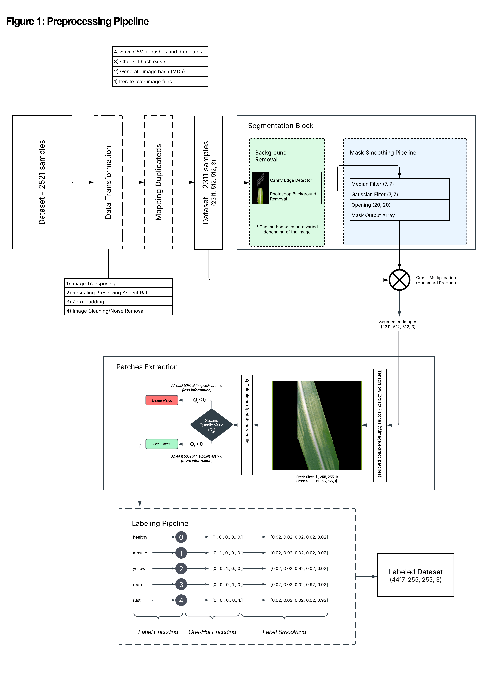
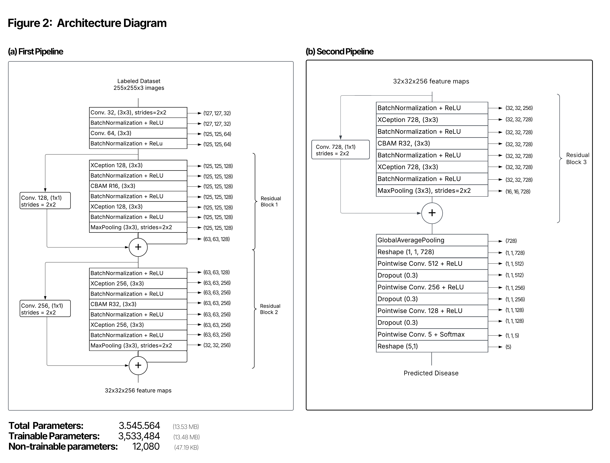
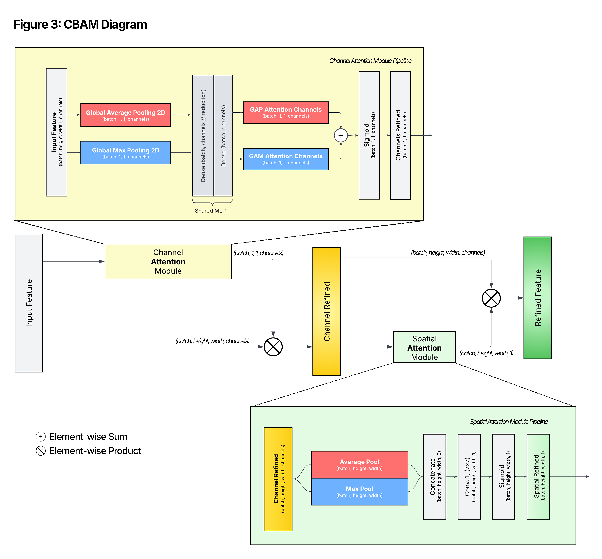
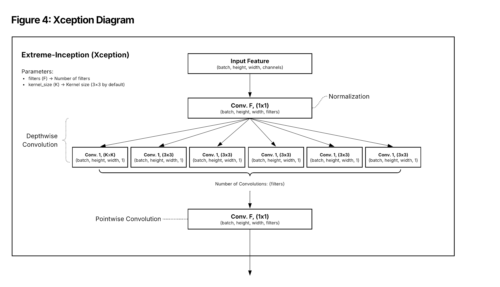
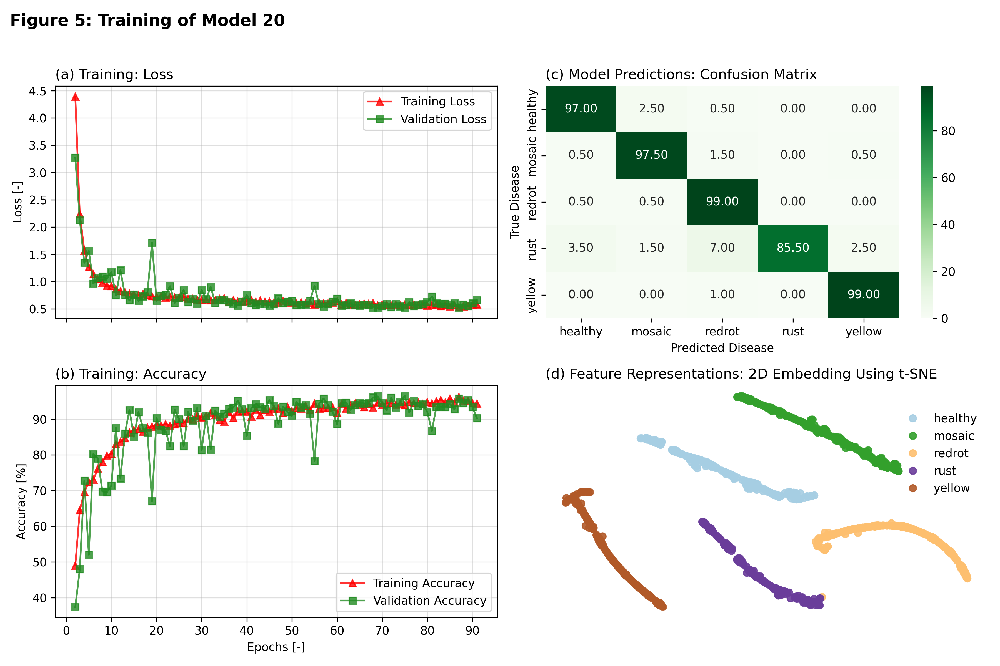

<a id="top"></a>


##  
* [Introduction](#introduction)
* [Preprocessing](#preprocessing)
* [Architecture](#architecture)

* [Training](#training)
  * [Hyperparameters](#hyperparameters)
  * [Learning Rate Scheduler](#learning-rate-scheduler)
  * [Loss Function and Metrics](#loss-function-and-metrics)
  * [Data Augmentation](#data-augmentation)
* [How to use it?](#how-to-use-it)
* [What's next?](#whats-next)


## Introduction
The diseases that affect crops, including sugarcane and other plants, have a huge impact on the agronomy sector, forcing farmers to use pesticides and other chemicals to protect their crops against these agents, saving costs and increasing profits.

Note that these pesticides are generally toxic, and their presence in high quantities can be harmful to human health. Additionally, the use of such substances can contribute to climate change, as their decomposition releases greenhouse gases such as N2O, which is commonly found in pesticide compositions. Because of that, clever solutions that address this problem are highly welcome. 

To contribute to this goal and take a step forward in this field, we developed a deep neural network model capable of predicting diseases in sugarcane leaves, using Residual Blocks composed of traditional Convolutional Neural Network (CNN) layers, integrated with Extreme Inception ([Xception](figures/xception.png)) and Convolutional Block Attention Module ([CBAM](figures/cbam.png)) layers in between.

[↑ Top](#top)

## Preprocessing
During the preprocessing phase, we utilized a dataset [[5]](https://doi.org/10.17632/9twjtv92vk.1) composed of five labels: healthy, mosaic, redrot, rust, and yellow.

The first step was data transformation, where we transposed, rescaled, and applied zero-padding to ensure a consistent shape of (512, 512) across all images. Additionally, we removed low-quality images when necessary.

To eliminate potential duplicate images, we implemented a Mapping Duplicates Pipeline. This pipeline uses image hashing (MD5) to detect duplicates, storing flagged images in a CSV file. After this step, our dataset was refined to 2311 samples.

Next, we developed a Segmentation Block, composed of two key components:

* Background Removal

* Mask Smoothing Pipeline

For Background Removal, we applied two different approaches: the Photoshop background removal tool and a Canny edge detector (Python). Although both methods were effective, their outputs contained noise, which required post-processing.

To address this, we introduced the Mask Smoothing Pipeline, which applied a combination of median filtering, Gaussian filtering, and morphological opening operations. This process helped refine the segmented images, ensuring high-quality masks.

At this stage, we had 2311 high-quality samples, all in the (512, 512, 3) format.

To increase the dataset size for training, we employed a TensorFlow-based patch extraction method, as shown in Figure 1. Given that pixel values ranged between [0, 255], we implemented a Second Quartile Measurement (Q2), extracting only high-information patches (i.e., patches where at least 50% of pixels were non-zero).

Finally, we developed a labeling pipeline, which converted string labels into label-smoothed tensors [[4]](https://arxiv.org/abs/1906.02629). This technique helps improve model generalization by preventing overconfidence in predictions.



[↑ Top](#top)

## Architecture
The architecture we selected for our model is shown in Figure 2 below.


Our model follows a sequential structure with residual blocks arranged in a sandwich-like configuration, where the core combination consists of [Xception](figures/xception.png), [CBAM](figures/cbam.png), and [Xception](figures/xception.png) modules. We implemented [CBAM](figures/cbam.png) (as shown in fig. 3) because it is a lightweight feature refinement module that generates attention maps [[6]](https://doi.org/10.1007/978-3-030-01234-2_1), capturing both channel-wise and spatial attention.

[](figures/cbam.png)


To further enhance feature extraction efficiency, we integrated [Xception](figures/xception.png) (Extreme Inception) blocks into our architecture. [Xception](figures/xception.png) (as shown in fig. 4) improves on traditional Inception modules by leveraging depthwise separable convolutions, which reduce the number of parameters while preserving powerful representational capacity [[1]](https://doi.org/10.1109/CVPR.2017.195). This combination of [CBAM](figures/cbam.png) and [Xception](figures/xception.png) helps to optimize both feature refinement and extraction efficiency, driving better performance in classification tasks.

Unlike standard convolutional layers, depthwise separable convolutions break down the process into two distinct steps:

* Depthwise convolution applies a single filter to each input channel independently.

* Pointwise convolution (1x1 convolution) then combines the outputs from the depthwise convolution, enabling efficient cross-channel interactions.

[](figures/xception.png)

This approach significantly lowers computational costs while maintaining high expressiveness in feature extraction. By combining [Xception](figures/xception.png) blocks with [CBAM](figures/cbam.png) modules, our model benefits from both enhanced attention mechanisms ([CBAM](figures/cbam.png)) and optimized feature representations ([Xception](figures/xception.png)). This synergy leads to improved classification performance while maintaining efficiency.

Moreover, deep convolutional networks are known to learn increasingly complex representations through a series of convolutional layers with progressively larger numbers of kernels. Following those ideas proposed in the AlexNet paper [3], we incorporated plenty of convolutional layers, with progressively larger numbers of filters.

Instead of using an average pooling layer [[2]](https://doi.org/10.1109/CVPR.2016.90) — which aggregates spatial information—we opted for max pooling, which yielded better results while preserving the same purpose of aggregation. Max pooling also acts as a distinctive feature selector for objects [[6]](https://doi.org/10.1007/978-3-030-01234-2_1) and helps reduce the number of parameters.

Finally, to mitigate the vanishing gradient problem, we applied a residual approach to connect the blocks, following the methodology proposed by ResNet architectures [[2]](https://doi.org/10.1109/CVPR.2016.90).

[↑ Top](#top)

## Training


|           | precision       |  recall       | f1-score       | support       |
|-----------|-----------------|---------------|----------------|---------------|
|  healthy |   0.96  |  0.97  | 0.96  | 200 |
|  mosaic  |   0.96  |  0.97  | 0.97  | 200 |
|  redrot  |   0.91  |  0.99  | 0.95  | 200 |
|  rust    |   1.00  |  0.85  | 0.92  | 200 |
|  yellow  |   0.97  |  0.99  | 0.98  | 200 |
||||||
|  accuracy      |         |        | 0.96  | 1000 |
|  macro avg     |   0.96  |  0.96  | 0.96  | 1000 |
|  weighted avg  |   0.96  |  0.96  | 0.96  | 1000 |

### Hyperparameters

The following hyperparameters were used for model training:

| Hyperparameter     | Value  |
|-------------------|--------|
| Learning Rate    | 0.001  |
| Dropout Rate     | 0.3    |
| L2 Regularization | 0.005  |
| Batch Size       | 16     |
| Epochs           | 90     |

### Learning Rate Scheduler  
A **Cosine Decay** learning rate scheduler was used with the following configuration:

- **Initial Learning Rate**: 0.001  
- **Decay Steps**: `batch_size * batches_per_epoch * epochs`  
- **Alpha (Final Learning Rate Multiplier)**: 0.0  

### Loss Function and Metrics  
- **Loss Function**: Categorical Crossentropy  
- **Evaluation Metric**: Accuracy  

### Data Augmentation  

Data Augmentation was applied **only to the training data (`X_train`)** with the following configurations:

- **Rotation**: 20°  
- **Horizontal Shift**: 20%  
- **Vertical Shift**: 20%  
- **Shear**: 20%  
- **Zoom**: 20%  
- **Horizontal Flip**: Yes  
- **Fill Mode**: Constant  

[↑ Top](#top)

### How to use it?
```python
# Clone this repository
!git clone https://github.com/NeoGreenCode/SugarcaneLeafDisease.git
```
```python
from SugarcaneLeafDisease.models import Model_20

images = np.random.rand(400, 212, 212, 3)  # Set your images here — must have 3 channels and shape (batch, height, width, channels).
model = Model_20(verbose=False)  # Instantiate the Model_20 architecture.
predict = model.predict(images, patch_size=250, use_patches=True)  # Predicted tensor with shape (batch, rows, cols, 5), where rows and cols represent the grid dimensions of the extracted patches.
predicted_decoded = model.decode(predict)  # Decode the predicted tensor to convert one-hot encoding into labels.
```
```python
# Plotting the results for each patch — pass the image index to plot based on the length of the predict array.

```

[↑ Top](#top)

### What's next?
In conclusion, while our project serves its purpose — predicting diseases in sugarcane leaves — we envision that, to achieve its full potential, one possible step is the incorporation of more samples into the dataset. This would help refine the decision boundary between 'healthy' and 'mosaic' disease, as well as exploring advanced techniques such as transformers. 

Additionally, expanding the dataset to include Wilt, White Leaf Disease, and Pokkah Boeng could potentially enhance the model’s applicability and improve its generalization in predicting these diseases.

Moreover, the integration of various sensor data, coupled with a self-driving drone — trained using reinforcement learning — that can navigate through the farm, mapping areas that require pesticides and predicting the specific diseases affecting the crop, is another promising approach.

This onboard clever solution could potentially reduce costs by applying pesticides only to critical affected areas. It would also help decrease greenhouse gas emissions and lower the use of chemicals on crops.

[↑ Top](#top)

### References
**1**. Chollet, F. (2017). Xception: Deep learning with depthwise separable convolutions. In Proceedings of the IEEE Conference on Computer Vision and Pattern Recognition (CVPR), 1251–1258. https://doi.org/10.1109/CVPR.2017.195

**2**. He, K., Zhang, X., Ren, S., & Sun, J. (2016). Deep residual learning for image recognition. In Proceedings of the IEEE Conference on Computer Vision and Pattern Recognition (CVPR), 770–778. https://doi.org/10.1109/CVPR.2016.90

**3**. Krizhevsky, A., Sutskever, I., & Hinton, G. E. (2012). ImageNet classification with deep convolutional neural networks. In Advances in Neural Information Processing Systems (NeurIPS), 25, 1097–1105.

**4**. Müller, R., Kornblith, S., & Hinton, G. (2019). When does label smoothing help? Advances in Neural Information Processing Systems (NeurIPS), 32. https://arxiv.org/abs/1906.02629

**5**. Thite, S., Suryawanshi, Y., Patil, K., & Chumchu, P. (2023). Sugarcane leaf image dataset (V1). Mendeley Data. https://doi.org/10.17632/9twjtv92vk.1

**6**. Woo, S., Park, J., Lee, J.-Y., & Kweon, I. S. (2018). CBAM: Convolutional Block Attention Module. In Proceedings of the European Conference on Computer Vision (ECCV) (pp. 3–19). https://doi.org/10.1007/978-3-030-01234-2_1


