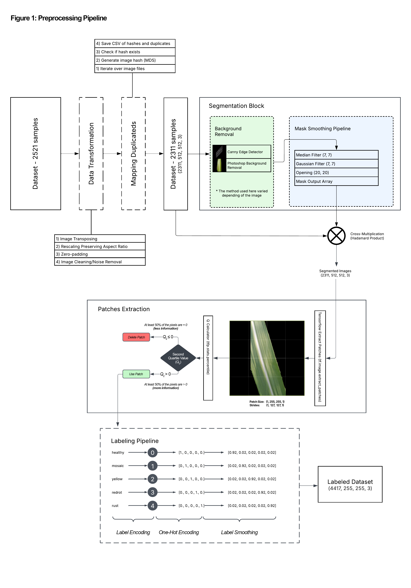
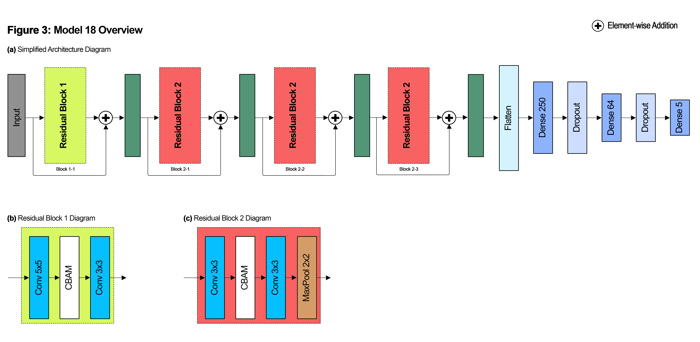

## Introduction
The diseases that affect crops, including sugarcane and other plants, have a huge impact on the agronomy sector, forcing farmers to use pesticides and other chemicals to protect their crops against these agents, saving costs and increasing profits.

Note that these pesticides are generally toxic, and their presence in high quantities can be harmful to human health. Additionally, the use of such substances can contribute to climate change, as their decomposition releases greenhouse gases such as N2O, which is commonly found in pesticide compositions. Because of that, clever solutions that address this problem are highly welcome. 

To contribute to this goal and take a step forward in this field, we developed an AI tool capable of predicting diseases in sugarcane leaves, using Residual Blocks composed of traditional CNN layers with [CBAM](figures/cbam.png) layers in between.

## Preprocessing
During the preprocessing phase, we utilized a dataset [[1]](https://doi.org/10.17632/9twjtv92vk.1) composed of 5 types of labels: healthy, mosaic, redrot, rust, and yellow.

The first process we conducted was the rotation of the images to a vertical orientation. After that, we resized all the samples to 512x512 pixels*. During this process, we occasionally encountered some duplicate images, which required us to implement a code to remove them using a hashing algorithm.

The next phase was a segmentation task, where we utilized two different approaches: the Photoshop background removal tool and a Canny edge detector using Python. Although both implementations worked for our goal, their results presented some noise, which had to be addressed through a smoothing pipeline (as shown in Fig. 2).

After this process, all the samples were segmented and ready to be used in the training phase.

Note that the entire preprocessing pipeline can be seen in Figure 1.




## Architecture
The architecture we selected for our model can be seen in Figure 4 below.

Note that it is a sequential model with residual blocks—Block Type 1 and Block Type 2 (as shown in Fig. 3-b and 3-c). These blocks have a sandwich-like composition, with a Conv-CBAM-Conv structure as the key combination. In this case, we implemented [CBAM](figures/cbam.png) because it is a lightweight feature refinement module that infers attention maps [[2]](https://doi.org/10.1007/978-3-030-01234-2_1), including both channel and spatial maps.

Moreover, deep convolutional networks are known to learn increasingly deeper representations through long sequences of convolutional layers with progressively more kernels. As a consequence, we followed those same principles proposed in AlexNet paper [3], incorporating a total of fiveteen convolutional layers.

Furthermore, instead of utilizing an average pooling layer [[4]](https://doi.org/10.1109/CVPR.2016.90) — which serves as an aggregator of spatial information — we opted for max pooling, which produced better results while maintaining the same aggregation purpose — max pooling also acts as a distinctive object feature selector [[2]](https://doi.org/10.1007/978-3-030-01234-2_1) — and reduce the number of parameters.

At last, in order to avoid the vanishing gradient problem, we employed a residual approach to connect these residual blocks, following the proposed approach of typical ResNet architectures [[4]](https://doi.org/10.1109/CVPR.2016.90).




## Training


|           | precision       |  recall       | f1-score       | support       |
|-----------|-----------------|---------------|----------------|---------------|
|  healthy |   0.81  |  0.96  | 0.88  | 159 |
|  mosaic  |   0.90  |  0.69  | 0.78  | 102 |
|  redrot  |   0.97  |  0.94  | 0.95  | 158 |
|  rust    |   1.00  |  0.91  | 0.95  | 153 |
|  yellow  |   0.87  |  0.96  | 0.91  | 121 |
||||||
|  accuracy      |         |        | 0.90  | 693 |
|  macro avg     |   0.91  |  0.89  | 0.89  | 693 |
|  weighted avg  |   0.91  |  0.90  | 0.90  | 693 |

### How to use it?
```python
# Clone this repository
!git clone https://github.com/ClaytonSdS/SugarcaneLeafDisease.git
```
```python
from SugarcaneLeafDisease.models import Model_18

images = np.random.rand(400, 212, 212, 3) # Your images here—must have 3 channels.
model = Model_18()
model.predict(images)
```


### What's next?
In conclusion, while our project serves its purpose — predicting diseases in sugarcane leaves — we envision that, to achieve its full potential, one possible step is the incorporation of more samples into the dataset. This would help refine the decision boundary between 'healthy' and 'mosaic' disease, as well as exploring advanced techniques such as transformers. 

Additionally, expanding the dataset to include Wilt, White Leaf Disease, and Pokkah Boeng could potentially enhance the model’s applicability and improve its generalization in predicting these diseases.

Moreover, the integration of various sensor data, coupled with a self-driving drone — trained using reinforcement learning — that can navigate through the farm, mapping areas that require pesticides and predicting the specific diseases affecting the crop, is another promising approach.

This onboard clever solution could potentially reduce costs by applying pesticides only to critical affected areas. It would also help decrease greenhouse gas emissions and lower the use of chemicals on crops.

#### References
**1**. Thite, S., Suryawanshi, Y., Patil, K., & Chumchu, P. (2023). Sugarcane leaf image dataset (V1). Mendeley Data. https://doi.org/10.17632/9twjtv92vk.1

**2**. Woo, S., Park, J., Lee, J.-Y., & Kweon, I. S. (2018). CBAM: Convolutional Block Attention Module. In Proceedings of the European Conference on Computer Vision (ECCV) (pp. 3–19). https://doi.org/10.1007/978-3-030-01234-2_1  

**3**. Krizhevsky, A., Sutskever, I., & Hinton, G. E. (2012). ImageNet classification with deep convolutional neural networks. In Advances in neural information processing systems (NeurIPS), 25, 1097–1105.  

**4**. He, K., Zhang, X., Ren, S., & Sun, J. (2016). Deep residual learning for image recognition. In Proceedings of the IEEE Conference on Computer Vision and Pattern Recognition (CVPR), 770–778. https://doi.org/10.1109/CVPR.2016.90


